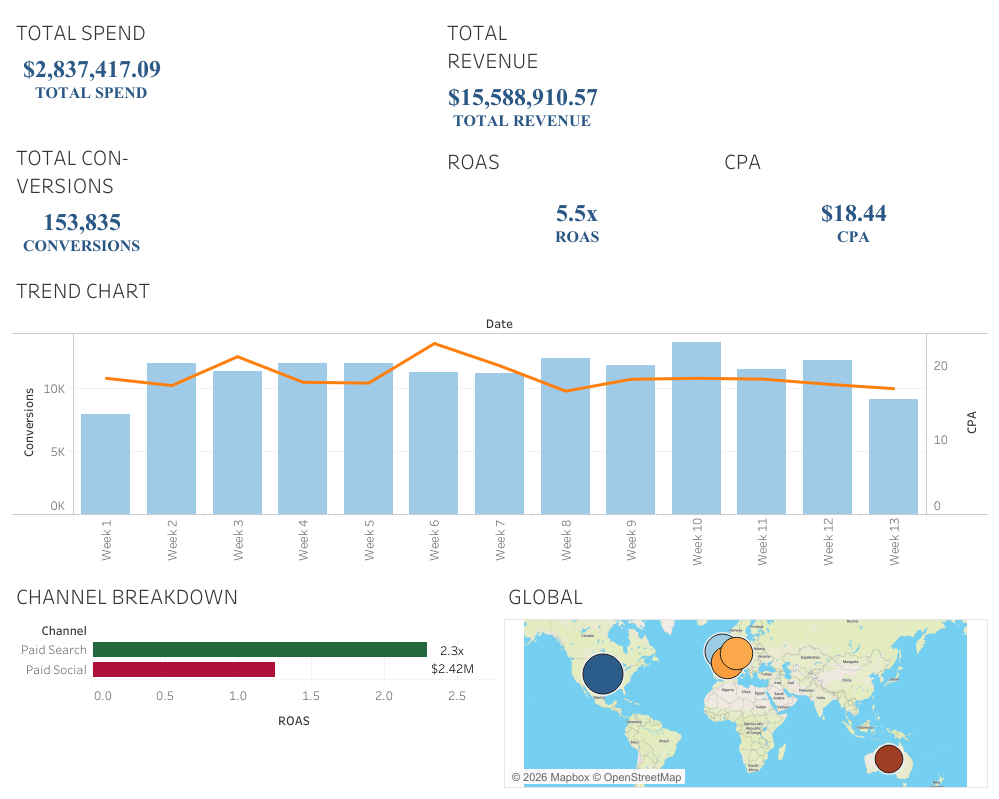

# Global Marketing Performance Analysis 

)

## Project Overview
I generated a synthetic marketing dataset using **Python** and built an interactive **Tableau** dashboard to identify efficiency gaps between Paid and Organic channels.

**Key Features:**
* **Interactive Drill-down:** Filter performance by Country, Channel, and Campaign.
* **Custom KPIs:** Engineered ROAS and CPA metrics.
* **Data Logic:** Python script ensures logical funnel constraints. 

## Files in this Repo
* `data_generator.py`: The Python script used to generate the dataset.
* `global_marketing_performance.twbx`: The raw Tableau workbook file.
